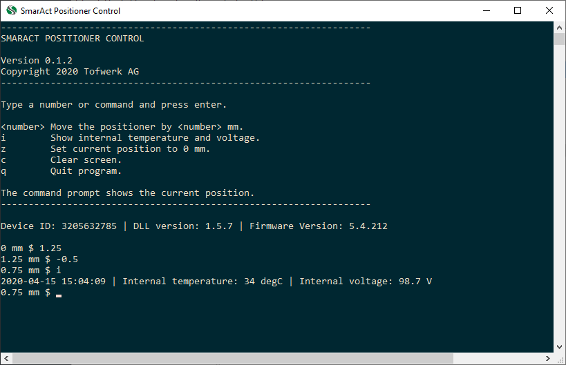

# SmarAct Positioner Control

Simple console program for controlling a SmarAct linear positioning stage
without position sensor. The positioning stage is connected to a Control 
Unit (CU) with USB interface.

Version 0.1.1  
Copyright 2019 Tofwerk AG

## smaract.exe



### Command line arguments

The program can also be used with command line arguments.

Usage:
```shell
smaract <number or command>
```

`<number>`  Move the positioner by `<number>` mm.  
`i`               Show some positioner diagnostic information.  
`h`               Show this help message.  
`z`               Set current position to zero.                      
